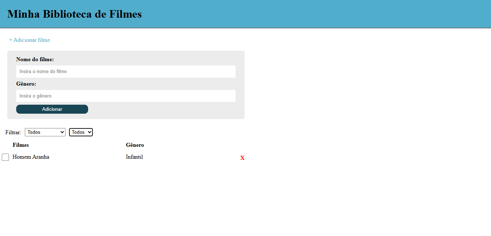

# 🎬 Minha Biblioteca de Filmes

🔗 **Projeto online:** [Clique aqui para acessar](https://biblioteca-de-filmes-eight.vercel.app/)

Projeto desenvolvido durante meu estudo de React.

Uma aplicação simples para adicionar, concluir e remover filmes.

## Preview

## Tecnologias

- React
- Vite
- JavaScript
- CSS
- LocalStorage

## Funcionalidades

- Adicionar filmes
- Informar gênero
- Marcar filme como assistido
- Remover filmes
- Filtrar por status
- Filtrar por gênero
- Persistência dos dados com LocalStorage
- Componentização

## Conceitos praticados

- useState
- useEffect
- Props
- Componentes reutilizáveis
- map()
- filter()
- Eventos
- Formulários
- JSON.stringify()
- JSON.parse()